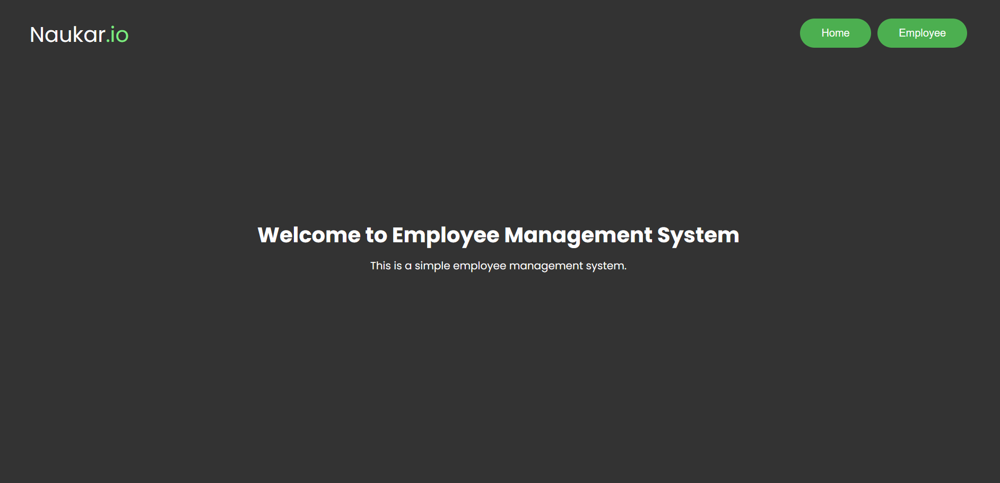
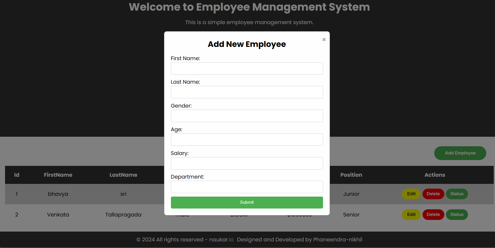

#  Employee Management System - Naukar.io

The Employee Management System is a straightforward web application developed using React.js. It offers users a platform to efficiently handle employee records, enabling tasks such as adding new employees, modifying existing details, and accessing comprehensive employee information.

## Table of Contents

- [Introduction](#introduction)
- [Features](#features)
- [Technologies](#technologies)
- [Usage](#usage)

## Introduction

The Employee Management System is a versatile web application designed to streamline the process of managing employee data within an organization. With its user-friendly interface and robust features, this system simplifies tasks related to employee record management, including adding new employees, updating existing information, and viewing detailed profiles. Powered by React.js, HTML, and CSS, this application offers a modern and efficient solution for businesses seeking to organize and optimize their workforce data. Whether you're a small startup or a large corporation, the Employee Management System provides the tools you need to effectively manage your employee database and ensure smooth operations within your organization.

## Features

1. **Add new employees** with essential details like first name, last name, gender, age, salary, and department.
2. **Edit employee** information, including their personal and professional details.
3. **Remove employees** from the system as necessary.
4. **Access detailed employee** profiles in a structured report card format.

  
  

## Technologies

- React.JS
- HTML
- CSS

## Usage

- Clone the repository to your local machine.
- Navigate to the project directory.
- Run **npm install** to install project dependencies.
- Execute **npm start** to launch the development server.
- Access the application through your web browser at http://localhost:5173.

# React + Vite

This tem
- [@vitejs/plugin-react](https://github.com/vitejs/vite-plugin-react/blob/main/packages/plugin-react/README.md) uses [Babel](https://babeljs.io/) for Fast Refresh
- [@vitejs/plugin-react-swc](https://github.com/vitejs/vite-plugin-react-swc) uses [SWC](https://swc.rs/) for Fast Refresh
